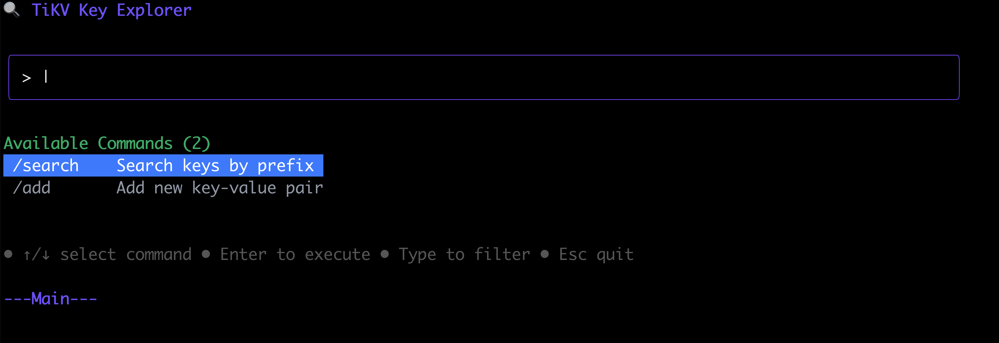
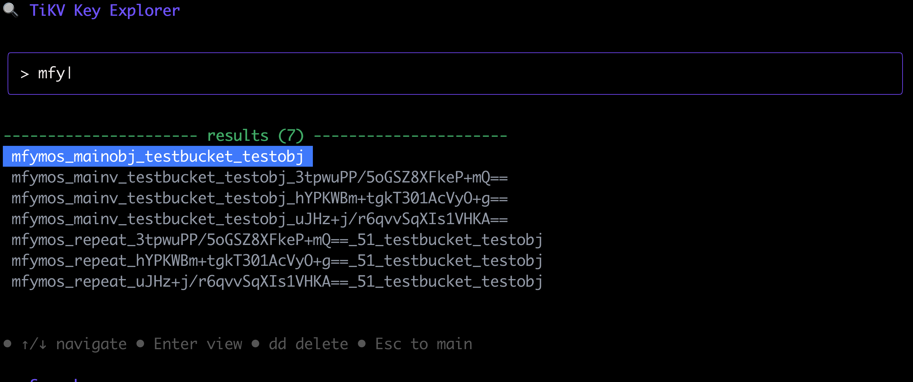

# TiKV 工具

## 概述

TiKV 工具是一个用于探索和管理 TiKV 键值数据的交互式命令行应用程序。它提供了类似 vim 的界面，用于浏览、查看、编辑和删除 TiKV 集群中的键。

  

## 功能特性

- **交互式键浏览器**：通过实时前缀搜索浏览 TiKV 键
- **Vim 风格界面**：熟悉的 vim 键位绑定用于导航和编辑
- **多格式支持**：自动检测并格式化 JSON、YAML、TOML 和纯文本
- **CRUD 操作**：支持创建、读取、更新和删除操作
- **复制到剪贴板**：一键复制键和值
- **多种视图模式**：
  - 主模式用于命令选择
  - 搜索模式用于查找键
  - 详情模式用于查看键值对
  - 编辑模式用于修改值
  - 添加模式用于创建新的键值对
- **终端用户界面**：使用 Bubble Tea 构建的简洁响应式界面

## 先决条件

- Go 1.21 或更高版本
- 访问带有 PD 端点的 TiKV 集群

## 安装

1. 克隆仓库：
```bash
git clone https://github.com/baixiaoshi/tikvtool.git
cd tikvtool
```

2. 构建应用程序：
```bash
# 支持 macOS arm64
make build-mac
# 支持 Linux amd64
make build-linux

# 其他平台请自行构建
```

## 使用方法

### 基本用法

```bash
# 使用 PD 端点连接到 TiKV
./tikvtool -e pd1:2379,pd2:2379,pd3:2379

# 示例
./tikvtool --endpoints 172.16.0.10:2379

# 或使用配置文件
./tikvtool -c ~/.tikvtool.json
```

### 配置文件格式

创建一个 JSON 配置文件：
```json
{
  "PDAddress": ["pd1:2379", "pd2:2379", "pd3:2379"]
}
```

### 按键控制

**主模式（默认）：**
- `↑/↓`：浏览可用命令
- `Enter`：执行选中的命令
- 输入字符：过滤命令（`/search`、`/add`）
- `Esc`：退出应用程序

**搜索模式：**
- 输入字符：按前缀搜索键
- `↑/↓`：浏览搜索结果
- `Enter`：查看选中的键详情
- `dd`：删除选中的键
- `Esc`：返回主模式

**详情模式：**
- `i`：进入编辑模式
- `dd`：删除当前键
- `v`：切换到查看模式
- `c`：切换到命令模式
- `hjkl`：移动光标（在命令模式下）
- `Esc`：返回主模式

**编辑模式：**
- `i/a/o`：进入插入模式
- `Esc`：返回命令模式
- `hjkl`：移动光标
- `dd`：删除当前行
- `:w`：保存更改
- `:x` 或 `:wq`：保存并退出
- `:q`：不保存退出
- `:q!`：强制不保存退出

**添加模式：**
- 输入字符：输入键（步骤1）或值（步骤2）
- `Tab`：在键和值输入之间切换
- `Enter`：进入下一步或在值中添加换行
- `Ctrl+S`：保存键值对
- `Esc`：返回主模式

## 架构

项目分为几个包：

- `main.go`：应用程序入口点
- `cmd/`：命令行界面和配置
- `client/`：TiKV 客户端包装器
- `dao/`：键值操作的数据访问层
- `ui/`：使用 Bubble Tea 的终端用户界面
- `utils/`：格式检测和剪贴板操作的实用函数

## 依赖项

- **TiKV 客户端**：`github.com/tikv/client-go/v2` 用于 TiKV 连接
- **CLI 框架**：`github.com/spf13/cobra` 用于命令行界面
- **终端 UI**：`github.com/charmbracelet/bubbletea` 和 `github.com/charmbracelet/lipgloss` 用于交互式界面
- **格式支持**：`gopkg.in/yaml.v3` 用于 YAML，`github.com/BurntSushi/toml` 用于 TOML
- **剪贴板**：`github.com/atotto/clipboard` 用于复制功能

## 许可证

本项目采用 MIT 许可证。