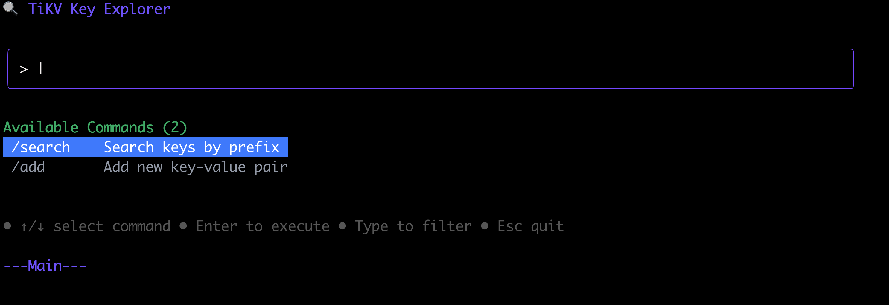
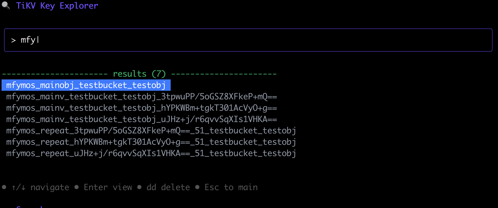
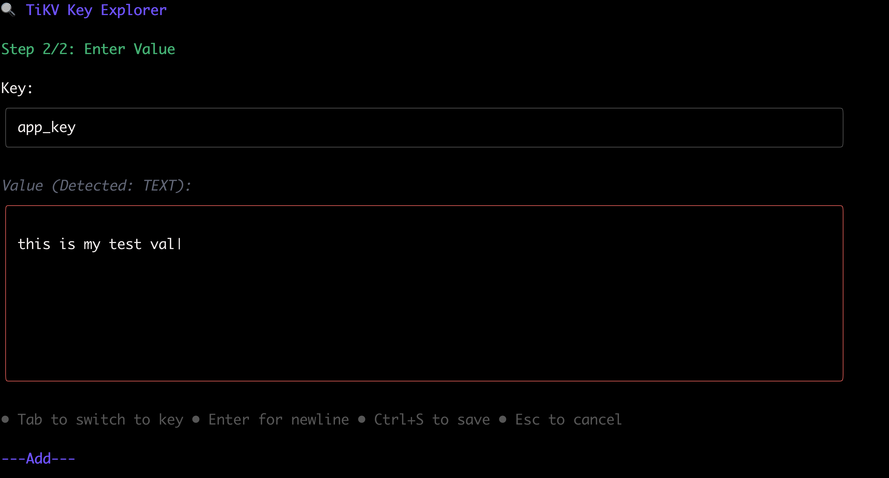

# TiKV Tool

## Overview

TiKV Tool is an interactive command-line application for exploring and managing TiKV key-value data. It provides a vim-like interface for browsing, viewing, editing, and deleting keys in your TiKV cluster.

   
 
## Features

- **Interactive Key Explorer**: Browse TiKV keys with real-time prefix searching
- **Vim-style Interface**: Familiar vim keybindings for navigation and editing
- **Multi-format Support**: Auto-detect and format JSON, YAML, TOML, and plain text
- **CRUD Operations**: Support for Create, Read, Update, and Delete operations
- **Copy to Clipboard**: Copy keys and values with one keystroke
- **Multiple View Modes**: 
  - Main mode for command selection
  - Search mode for finding keys
  - Detail mode for viewing key-value pairs
  - Edit mode for modifying values
  - Add mode for creating new key-value pairs
- **Terminal UI**: Clean, responsive interface built with Bubble Tea

## Prerequisites

- Go 1.21 or higher
- Access to a TiKV cluster with PD endpoints

## Installation

1. Clone the repository:
```bash
git clone https://github.com/baixiaoshi/tikvtool.git
cd tikvtool
```

2. Build the application:
```bash
# support macos arm64
make build-mac
# support linux amd64
make build-linux

#other platform build youself
```

## Usage

### Basic Usage

```bash
# Connect to TiKV using PD endpoints
./tikvtool -e pd1:2379,pd2:2379,pd3:2379

#example
./tikvtool --endpoints 172.16.0.10:2379

# Or use a config file
./tikvtool -c ~/.tikvtool.json
```

### Configuration File Format

Create a JSON config file:
```json
{
  "PDAddress": ["pd1:2379", "pd2:2379", "pd3:2379"]
}
```

### Key Controls

**Main Mode (Default):**
- `↑/↓`: Navigate through available commands
- `Enter`: Execute selected command
- Type to filter commands (`/search`, `/add`)
- `Esc`: Quit application

**Search Mode:**
- Type to search for keys by prefix
- `↑/↓`: Navigate through results
- `Enter`: View selected key details
- `dd`: Delete selected key
- `Esc`: Return to main mode

**Detail Mode:**
- `i`: Enter edit mode
- `dd`: Delete current key
- `v`: Switch to view mode
- `c`: Switch to command mode
- `hjkl`: Navigate cursor (in command mode)
- `Esc`: Return to main mode

**Edit Mode:**
- `i/a/o`: Enter insert mode
- `Esc`: Return to command mode
- `hjkl`: Navigate cursor
- `dd`: Delete current line
- `:w`: Save changes
- `:x` or `:wq`: Save and exit
- `:q`: Quit without saving
- `:q!`: Force quit without saving

**Add Mode:**
- Type to input key (step 1) or value (step 2)
- `Tab`: Switch between key and value input
- `Enter`: Proceed to next step or add newline in value
- `Ctrl+S`: Save key-value pair
- `Esc`: Return to main mode

## Architecture

The project is organized into several packages:

- `main.go`: Application entry point
- `cmd/`: Command-line interface and configuration
- `client/`: TiKV client wrapper
- `dao/`: Data access layer for key-value operations
- `ui/`: Terminal user interface using Bubble Tea
- `utils/`: Utility functions for format detection and clipboard operations

## Dependencies

- **TiKV Client**: `github.com/tikv/client-go/v2` for TiKV connectivity
- **CLI Framework**: `github.com/spf13/cobra` for command-line interface
- **Terminal UI**: `github.com/charmbracelet/bubbletea` and `github.com/charmbracelet/lipgloss` for interactive interface
- **Format Support**: `gopkg.in/yaml.v3` for YAML, `github.com/BurntSushi/toml` for TOML
- **Clipboard**: `github.com/atotto/clipboard` for copy functionality

## License

This project is licensed under the MIT License.